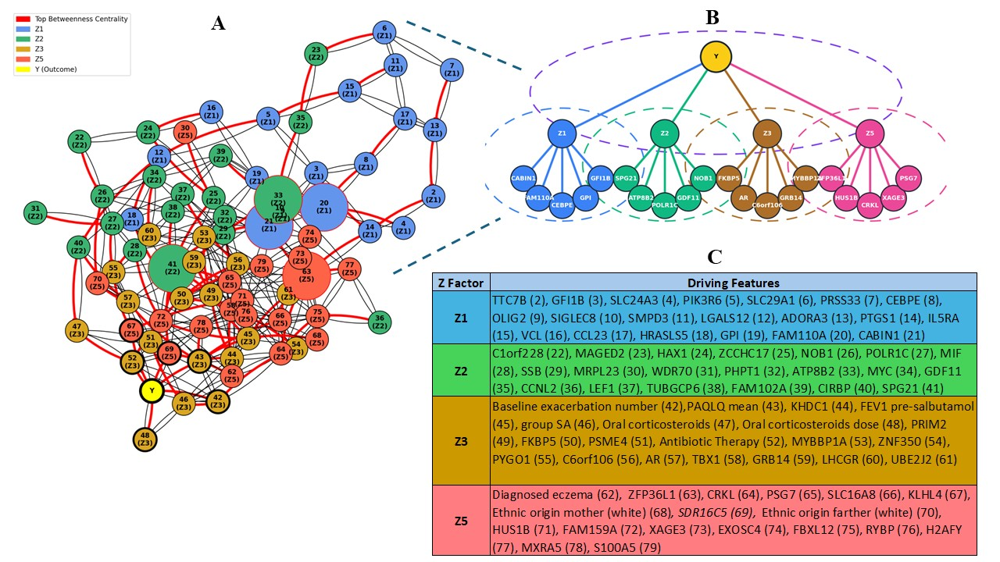

# Essential Regression (ER) – Latent Factor Analysis Pipeline



This folder contains the R implementation I used to run **Essential Regression (ER)** and downstream analyses on our pediatric asthma / multi-omics dataset, adapted from:

> Bing X., et al. **Essential Regression: A generalizable framework for inferring causal latent factors from multi-omic datasets**. *Patterns (NY)* 2022. PMID: 35607614.  
> Original codebase (ER): https://github.com/Jishnu-Lab/ER  
> PubMed Central version: https://pmc.ncbi.nlm.nih.gov/articles/PMC9122954/

1. run ER on a high-dimensional clinical + transcriptomic dataset (≈ 16,000 genes, ~200 subjects);
2. extract the latent factors **Z** that explain the variation in **X** (features);
3. connect those latent factors to the outcome (exacerbation vs no exacerbation);
4. build a **composite regression / network view** on top of ER outputs to make the results interpretable for clinicians.

This README explains what each script does and how to run them.

---

## Folder structure

```text
Latent-Factor-Analysis/
├── figures
├── ER_Apr13-v2.R
├── ER_CompositeRegression_Apr29.R
├── ER_graph_node.R
└── README.md 
