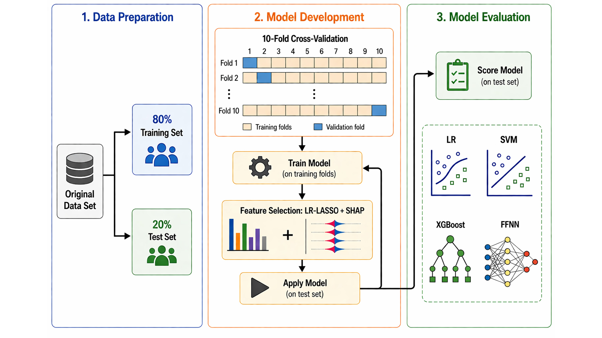

# ML Pipeline for Predicting Exacerbation Outcome

This repository contains code and documentation for the machine learning (ML) pipeline developed to analyze and predict clinical outcomes in pediatric asthma patients. 
The models were implemented and validated as part of the study:  
**"Exacerbation Risk Prediction in Pediatric Wheeze and Asthma Using Machine Learning-Based Integrative Multi-Omics Analysis"**.

<p align="center">
  
</p>

---

## 📊 Workflow Summary

The ML pipeline consists of the following key steps:

1. **Data Preparation**  
   - 80/20 train-test split on the original dataset  
   - Data preprocessing and MICE-imputation

2. **Model Training**  
   - 10-fold cross-validation on the training set  
   - Models: Logistic Regression (LR), Composite Regression (CR), Support Vector Machine (SVM), Decision Tree (XGBoost), Feedforward Neural Network (FFNN).

3. **Model Application and Evaluation**  
   - Trained models are applied to the test set  
   - Scoring includes accuracy, precision, recall, F1-score, Training vs Validation Loss, Training vs. Validation Accuracy, AUC-ROC
  
## 📌 Reproducibility

To reproduce the results:

### Create environment
**Install PyTorch from https://pytorch.org/get-started/locally/ (per your OS/CUDA)**
- `conda create -n ml-pipeline python=3.9 -y`  
- `conda activate ml-pipeline`  
- `pip install -r requirements.txt`

📚 **Python models guide:** see [docs/USAGE.md](docs/USAGE.md)

📚 **R models guide:** see [docs/USAGE_R.md](docs/USAGE_R.md)


### Run training
``python src/training.py``

### Run evaluation
``python src/evaluation.py``

### Notes
``--runs 5 expands {i} in file patterns to 1..5 (imputed datasets)``.

``--top-k 60 selects the top 60 SHAP features. To use 200 features, change to --top-k 200``.

``Results go to results/ and plots to figures/``.

``Target column is Exacerbation.Outcome. ID column is subject_id``.

``Optional merges:``

``--alpha "data/alpha_div/alpha_div_imputed_pmm{i}_Jan30.csv"``

``--beta "data/beta_div/beta_div_imputed_pmm{i}_Jan30.csv"``

``--raw-div "data/rawdiv/otutab_transp_div_imputed_fastFeb13.csv" --raw-div-pca-var 0.95``


## 👤 Contributors
This project was created and developed by:

**Cristina Longo, PhD**  
*Project leader, University of Montreal*

**Oleg S. Matusovsky, PhD** — [GitHub: matusoff](https://github.com/matusoff)  
*Lead developer of the ML models, data pipeline, and workflow design.*

**Data contributions from:**  
Ian M Adcock,
Lars I Andersson,
Charles Auffray,
K Fan Chung,
Sven-Erik Dahlen,
Bertrand De Meulder,
Ratko Djukanovic,
Peter Howarth,
Norbert Krug,
Amanda Roberts,
Ana R Sousa,
Peter J Sterk,
David Supple,
Graham Roberts,
Mohib Uddin,
Scott Wagers,
Anke-Hilse Maitland-van der Zee

## 📄 Citation
If you use this codebase, please cite:
``[DOI here once available]``

---

## 📂 Repository Structure

```bash
data/
├── gene/        # your_file.csv
├── clinical/    # your_file.csv
├── clingen/     # your_file.csv
├── exacer/      # your_file.csv
├── alpha_div/   # your_file.csv
├── beta_div/    # your_file.csv
└── rawdiv/      # your_file.csv
figures/         # workflow images & results
models/          # saved model weights/pipelines
results/         # metrics, curves, summaries
notebooks/       # exploratory notebooks
src/             # core python scripts
│   ├── preprocessing.py
│   ├── training.py          ← routes to feedforward.py
│   ├── evaluation.py        ← summarizes metrics by tag
│   └── feedforward.py       ← FFNN + SHAP top-K + optional merges
scripts/         # optional helpers
requirements.txt
README.md

